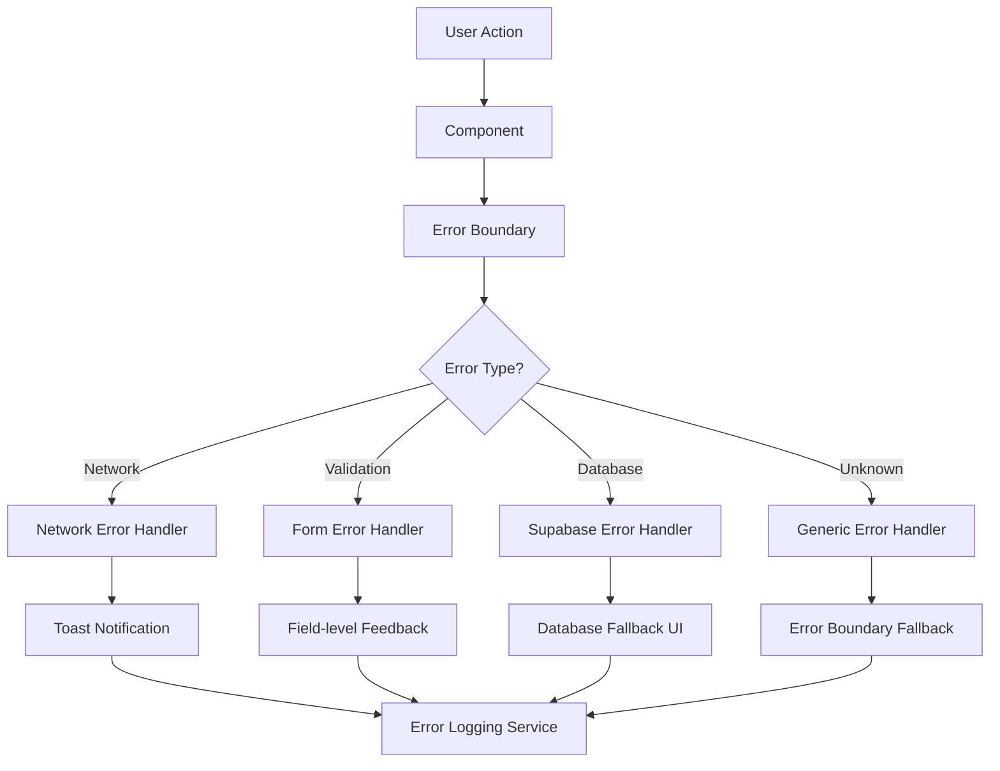
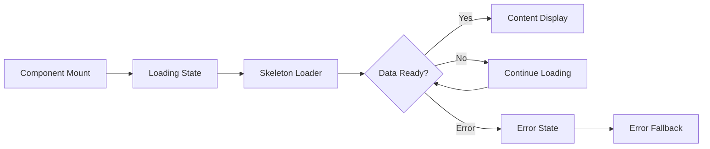

# Design Document

## Overview

This design document outlines the technical approach for resolving critical errors and implementing comprehensive UX/UI improvements across the startup matching platform. The solution focuses on creating a robust, accessible, and user-friendly experience while maintaining the existing Next.js/React/Supabase architecture.

## Architecture

### Error Handling Architecture



### Loading State Management



## Components and Interfaces

### 1. Enhanced Error Handling System

#### Error Boundary Component
```typescript
interface ErrorBoundaryProps {
  fallback?: React.ComponentType<ErrorFallbackProps>
  onError?: (error: Error, errorInfo: ErrorInfo) => void
  resetOnPropsChange?: boolean
  children: React.ReactNode
}

interface ErrorFallbackProps {
  error: Error
  resetError: () => void
  retry?: () => void
}
```

#### Toast Notification System
```typescript
interface ToastOptions {
  type: 'success' | 'error' | 'warning' | 'info'
  title: string
  description?: string
  duration?: number
  action?: {
    label: string
    onClick: () => void
  }
}
```

#### Error Handler Service
```typescript
interface ErrorHandlerService {
  handleSupabaseError(error: any): AppError
  handleNetworkError(error: any): AppError
  handleValidationError(errors: Record<string, any>): void
  handleAsync<T>(promise: Promise<T>, options?: AsyncOptions): Promise<T>
}
```

### 2. Loading State Components

#### Skeleton Loader System
```typescript
interface SkeletonProps {
  variant: 'text' | 'circular' | 'rectangular' | 'card' | 'table'
  width?: string | number
  height?: string | number
  lines?: number
  className?: string
}
```

#### Loading States
```typescript
interface LoadingStateProps {
  type: 'spinner' | 'skeleton' | 'progress'
  message?: string
  progress?: number
  className?: string
}
```

### 3. Responsive Design System

#### Breakpoint System
```typescript
const breakpoints = {
  xs: '320px',
  sm: '640px',
  md: '768px',
  lg: '1024px',
  xl: '1280px',
  '2xl': '1536px'
}
```

#### Responsive Table Component
```typescript
interface ResponsiveTableProps<T> {
  data: T[]
  columns: ColumnDef<T>[]
  mobileCardRenderer: (item: T) => React.ReactNode
  loading?: boolean
  error?: Error
  emptyState?: React.ReactNode
}
```

### 4. Form Enhancement System

#### Enhanced Input Component
```typescript
interface EnhancedInputProps {
  label: string
  error?: string
  helperText?: string
  success?: boolean
  required?: boolean
  loading?: boolean
  onValidate?: (value: string) => Promise<string | undefined>
  debounceMs?: number
}
```

#### Form Validation Hook
```typescript
interface UseFormValidationOptions {
  schema: ZodSchema
  mode: 'onChange' | 'onBlur' | 'onSubmit'
  revalidateMode: 'onChange' | 'onBlur'
}
```

### 5. Accessibility Components

#### Screen Reader Announcer
```typescript
interface AnnouncerProps {
  message: string
  priority: 'polite' | 'assertive'
  delay?: number
}
```

#### Focus Management
```typescript
interface FocusManagerProps {
  autoFocus?: boolean
  restoreFocus?: boolean
  trapFocus?: boolean
}
```

## Data Models

### Error Tracking Model
```typescript
interface ErrorLog {
  id: string
  timestamp: Date
  userId?: string
  errorType: 'network' | 'database' | 'validation' | 'unknown'
  errorCode?: string
  message: string
  stack?: string
  userAgent: string
  url: string
  resolved: boolean
}
```

### User Preferences Model
```typescript
interface UserPreferences {
  userId: string
  theme: 'light' | 'dark' | 'system'
  reducedMotion: boolean
  fontSize: 'small' | 'medium' | 'large'
  language: string
  notifications: {
    email: boolean
    push: boolean
    inApp: boolean
  }
}
```

## Error Handling

### Database Error Resolution

#### Missing Functions Fix
```sql
-- Create missing RPC functions
CREATE OR REPLACE FUNCTION get_unread_notification_count(user_uuid UUID DEFAULT NULL)
RETURNS INTEGER AS $$
DECLARE
    target_user_id UUID;
    unread_count INTEGER;
BEGIN
    target_user_id := COALESCE(user_uuid, auth.uid());
    
    IF target_user_id IS NULL THEN
        RETURN 0;
    END IF;
    
    SELECT COUNT(*)::INTEGER
    INTO unread_count
    FROM public.notifications
    WHERE user_id = target_user_id
    AND is_read = false;
    
    RETURN COALESCE(unread_count, 0);
END;
$$ LANGUAGE plpgsql SECURITY DEFINER;
```

#### Error Recovery Strategies
1. **Automatic Retry**: Implement exponential backoff for transient errors
2. **Fallback Data**: Cache critical data locally for offline scenarios
3. **Graceful Degradation**: Disable non-essential features when errors occur
4. **User Communication**: Clear messaging about what went wrong and next steps

### Client-Side Error Handling

#### Error Boundary Implementation
```typescript
class AppErrorBoundary extends Component<ErrorBoundaryProps, ErrorBoundaryState> {
  constructor(props: ErrorBoundaryProps) {
    super(props)
    this.state = { hasError: false, error: null }
  }

  static getDerivedStateFromError(error: Error): ErrorBoundaryState {
    return { hasError: true, error }
  }

  componentDidCatch(error: Error, errorInfo: ErrorInfo) {
    // Log error to monitoring service
    this.logError(error, errorInfo)
    
    // Call optional error handler
    this.props.onError?.(error, errorInfo)
  }

  render() {
    if (this.state.hasError) {
      return this.props.fallback ? (
        <this.props.fallback 
          error={this.state.error!} 
          resetError={this.resetError}
        />
      ) : (
        <DefaultErrorFallback 
          error={this.state.error!}
          resetError={this.resetError}
        />
      )
    }

    return this.props.children
  }
}
```

## Testing Strategy

### Error Handling Tests
1. **Unit Tests**: Test individual error handlers and boundary components
2. **Integration Tests**: Test error flows across components
3. **E2E Tests**: Test user-facing error scenarios
4. **Accessibility Tests**: Ensure error states are accessible

### Performance Tests
1. **Loading Performance**: Measure skeleton loader effectiveness
2. **Error Recovery**: Test recovery time from various error states
3. **Mobile Performance**: Test responsive design on various devices

### Test Coverage Requirements
- Error handling functions: 95%
- Loading state components: 90%
- Responsive components: 85%
- Accessibility features: 100%

## Implementation Phases

### Phase 1: Critical Error Resolution (Week 1)
1. Fix database function errors
2. Implement basic error boundaries
3. Add toast notification system
4. Create loading state components

### Phase 2: Enhanced UX (Week 2)
1. Implement skeleton loaders
2. Add form validation improvements
3. Create empty state components
4. Enhance mobile responsiveness

### Phase 3: Accessibility & Polish (Week 3)
1. Add ARIA labels and keyboard navigation
2. Implement focus management
3. Add screen reader support
4. Optimize color contrast

### Phase 4: Performance & Monitoring (Week 4)
1. Add error logging and monitoring
2. Implement performance optimizations
3. Add user preference system
4. Final testing and QA

## Monitoring and Analytics

### Error Tracking
- Implement Sentry for error monitoring
- Track error rates by component and user action
- Monitor error resolution times
- Set up alerts for critical errors

### User Experience Metrics
- Page load times
- Form completion rates
- Error recovery success rates
- Mobile vs desktop usage patterns

### Accessibility Metrics
- Keyboard navigation usage
- Screen reader compatibility scores
- Color contrast compliance
- Focus management effectiveness

## Security Considerations

### Error Information Disclosure
- Sanitize error messages shown to users
- Log detailed errors server-side only
- Implement rate limiting for error endpoints
- Secure error logging data

### Database Security
- Ensure RLS policies are properly configured
- Validate all database function parameters
- Implement proper authentication checks
- Monitor for SQL injection attempts

## Deployment Strategy

### Database Updates
1. Test SQL fixes in development environment
2. Create migration scripts for production
3. Implement rollback procedures
4. Monitor database performance post-deployment

### Frontend Deployment
1. Feature flag new error handling components
2. Gradual rollout of responsive design changes
3. A/B testing for UX improvements
4. Performance monitoring during rollout

## Success Metrics

### Technical Metrics
- 95% reduction in database function errors
- 50% reduction in unhandled JavaScript errors
- 90% improvement in loading state consistency
- 100% WCAG 2.1 AA compliance

### User Experience Metrics
- 30% reduction in user-reported issues
- 25% improvement in form completion rates
- 40% increase in mobile user satisfaction
- 20% reduction in support tickets

### Performance Metrics
- Page load times under 2 seconds
- Error recovery within 5 seconds
- 99.9% uptime for critical functions
- Mobile performance score above 90